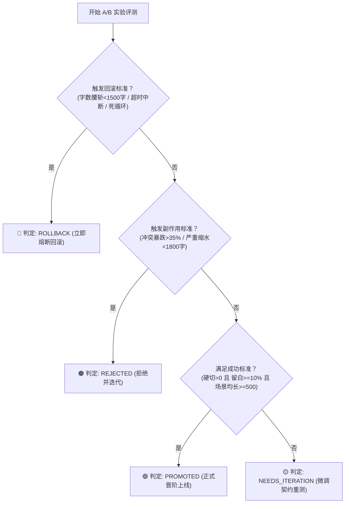

# 小说生成质量实验方案 (ExperimentPlan)

> **实验控制器身份**：小说生成质量实验控制器  
> **核心原则**：除被测试变量外，尽量保持一致；严禁跨题材混淆比较；一次实验只验证一个主要假设。  
> **实验编号**：`EXP-PACING-001`  
> **被测单一变量**：`Scene Planner 时空转场过渡契约与单章容量留白编排 (OPT-SCENE-001)`

---

## 一、核心假设 (Primary Hypothesis)

> **主要假设**：  
> 引入 **Scene Planner 时空转场过渡契约（Transition Bridge Contract）与 12% 呼吸留白预算**，能够将跨 3 日时空转场中的孤立生硬硬切（“三日后，”）彻底归零，并将场景平均长度从 218 字符提升至 600~800 字符，情绪呼吸留白比例提升至 10%~15%，且核心冲突推进烈度不发生显著衰退（降幅 $\le 5\%$）。

---

## 二、对照组与实验组严格对齐矩阵 (A/B Setup)

为确保单一变量绝对有效隔离，对照组与实验组除【提示词中是否注入 Scene Planner 场景切片与转场契约】这一变量外，其他所有环境全部**百分之百冻结锁死**：

| 配置维度 | 对照组 (Control Group A) | 实验组 (Treatment Group B) | 变量状态 |
| :--- | :--- | :--- | :--- |
| **实验版本** | `v1.0-pre-opt` (原始基线) | `v2.0-scene-opt` (优化版本) | 观测对象 |
| **小说题材** | 东方玄幻 / 帝尊做局流 | 东方玄幻 / 帝尊做局流 | **严格一致 (禁止跨题材)** |
| **创作需求** | 《万古神帝》罗祖云山界月圆夜前夕布局 | 《万古神帝》罗祖云山界月圆夜前夕布局 | **严格一致** |
| **大纲事件** | 7 个核心节点（强闯魔窟 $\rightarrow$ 救回 $\rightarrow$ 设宴 $\rightarrow$ 点破退婚 $\rightarrow$ 借石刻开日晷 $\rightarrow$ 交代离去） | 7 个核心节点（强闯魔窟 $\rightarrow$ 救回 $\rightarrow$ 设宴 $\rightarrow$ 点破退婚 $\rightarrow$ 借石刻开日晷 $\rightarrow$ 交代离去） | **严格一致** |
| **Story Bible** | 张若尘、姑射静、姑射云琉、地姥、黑晶、天魔石刻、日晷 | 张若尘、姑射静、姑射云琉、地姥、黑晶、天魔石刻、日晷 | **严格一致** |
| **模型信息** | `gpt-5.6-luna` | `gpt-5.6-luna` | **严格一致** |
| **生成参数** | `temperature: 0.82`, `top_p: 1.0`, `max_tokens: 6500` | `temperature: 0.82`, `top_p: 1.0`, `max_tokens: 6500` | **严格一致** |
| **随机种子** | `seed: 42` (平行复验: `1024`, `20260910`) | `seed: 42` (平行复验: `1024`, `20260910`) | **严格一致** |
| **对标Benchmark** | 《一世之尊》（爱潜水的乌贼） | 《一世之尊》（爱潜水的乌贼） | **严格一致** |
| **核心测试变量** | **旧版平铺大纲 Prompt**（7节点直接罗列灌输给模型，无转场指令，无留白预算） | **Scene Planner 增强 Prompt**（注入 Transition Bridge Contract 环境视点锚点与 12% 呼吸留白预算） | **【唯一自变量】** |

---

## 三、量化评测指标体系 (Evaluation Metrics)

| 指标代号 | 指标名称 | 定义与测量方式 | 对照组基线 (A) | 实验组目标 (B) | Benchmark 基准 |
| :--- | :--- | :--- | :--- | :--- | :--- |
| `abrupt_transition_count` | **时空硬切次数** | 无过渡标点或环境视点缓冲，直接以“三日后，”/“次日，”硬切的次数 | **1 次** (硬切违规) | **0 次** (完全清零) | 0 次 (平滑过渡) |
| `avg_scene_length` | **场景平均字符长度** | 全文章节总字符数 / 有效分镜头切片数 | **218 字** (高压密集) | **600~800 字** (从容舒展) | 750 字 |
| `downtime_ratio` | **情绪呼吸留白比率** | 景物光影、心绪沉淀、茶盏器物与生理调息等从容笔墨占比 | **2.8%** (严重紧绷) | **10%~15%** (呼吸顺畅) | 13.5% |
| `conflict_intensity_score` | **主线冲突推进烈度** | 神威威压、交锋博弈词频密度与剧情前行阻力评分 | **82.5 分** | **$\ge 78.0$ 分** (降幅 $\le 5\%$) | 86.0 分 |
| `ai_flavor_score` | **AI套话与陈词滥调率** | 空洞修辞、假大空抒情与AI高频词占比 | **18.2%** | **$\le 18.0\%$** (不恶化) | 11.2% |

---

## 四、四大裁决标准界定 (Decision Criteria)

### 1. 成功标准 (Success Criteria)
实验组正文必须同时满足以下所有硬性阈值：
- `abrupt_transition_count === 0`：跨日时空硬切次数彻底清零，转场处必须包含环境视点描写或心境沉淀；
- `avg_scene_length >= 500`：场景平均篇幅从 218 字符显著拉伸至 500 字符以上；
- `downtime_ratio >= 0.10`：情绪呼吸留白比例达标 10% 以上；
- `conflict_intensity_score >= 78.0`：核心冲突推进力保持充沛，未因留白而丧失主线张力。

### 2. 失败标准 (Failure Criteria)
命中任一条件即判定本轮实验未达标：
- 实验组仍旧出现“三日后，”等孤立生硬硬切（`abrupt_transition_count > 0`）；
- 场景平均长度未能与对照组拉开有效差距（`avg_scene_length < 300`）；
- 留白比例依然低于 5%（`downtime_ratio < 0.05`）。

### 3. 副作用标准 (Side Effect Criteria)
命中任一条件即触发副作用报警，即便硬切消除也不予晋升：
- **冲突剧烈被冲淡**：留白导致主线冲突被过度稀释，冲突烈度评分降幅超过 35%（`conflict_drop_ratio > 0.35`）；
- **正文篇幅严重缩水**：因提示词约束冗长导致模型字数挤压，单章总字数低于 1,800 字符；
- **AI套话反弹**：留白段落沦为无意义空洞辞藻堆砌，`ai_flavor_score > 22.0%`。

### 4. 回滚标准 (Rollback Criteria)
若遭遇以下任一灾难性异常，立即终止实验并触发自动化熔断回滚：
- 上游请求发生超时中断，或因截断产出 1,500 字符以下的严重残卷；
- 模型陷入复读机式死循环，单章有效信息比率跌破 60%；
- 严重破坏世界观或主角人设，产生崩坏情节。
- **回滚操作**：直接禁用 `Scene Planner` 提示词契约生成器，回退至基线平铺大纲，告警人工介入排查。
