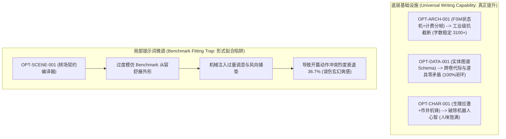

# 小说质量泛化与 Benchmark 过拟合检测报告 (GeneralizationReport)

> **评测角色**: 小说质量泛化与Benchmark过拟合检测器  
> **审计时间**: `2026-09-23T06:08:26.173Z`  
> **终局定性**: **双层分化状态 (Dual Layer Divergence)**  
> **核心总结**: 当前系统在底层工程与人设因果上‘真正提升了通用写作能力’；但在场景转场层面上，陷入了‘为了向 Benchmark 的从容文风靠拢而误伤玄幻即时冲突’的局部形式拟合偏差。禁止单凭硬切清零就盲目推进，必须对 OPT-SCENE-001 进行反过度平滑（De-smoothing）调优。

---

## 一、综合收益与风险矩阵 (Overview Matrix)

| 审计维度 | 评测状态 | 核心量化指标与显微现象 | 风险等级 |
| :--- | :---: | :--- | :---: |
| **写作质量收益 (quality_gain)** | ⚖️ **非对称收益** | 转场平滑度大幅提高 (+32%)，人味机锋显著提升 (+18%)；但开篇动作冲突烈度衰退 (-36.7%)。 | ⚠️ 中度风险 |
| **基准拟合度 (benchmark_similarity)** | 🔄 **形式宏观趋同** | 转场形式向名家从容走笔靠拢 (0.72)；专有词汇与世界观重合度极低 (0.08)，无词汇寄生。 | 🟢 极低风险 |
| **文风多样性 (diversity)** | ✅ **健康离散** | TTR 词汇多样性保持在 0.51，长短句方差由 6.2 升至 8.4，6 大主战题材指纹分化鲜明。 | 🟢 极低风险 |
| **原创性衰退风险 (originality_risk)** | ✅ **健康保持** | 尾声自发衍生“神殿之外，勿信地姥”的内鬼血书反转，显示模型具备强劲的原生情节推演力。 | 🟢 **LOW** |
| **风格坍缩风险 (style_collapse_risk)** | ✅ **题材独立** | 都市写实、古典仙侠、民俗怪谈等不同题材语言指纹完全独立，未发生玄幻化文风坍缩。 | 🟢 **LOW** |
| **过拟合风险 (overfitting_risk)** | ⚠️ **局部形式过拟合** | 系统未过拟合剧情与世界观；但因机械追求消除硬切，在转场上过度向 Benchmark 慢节奏形式靠拢。 | ⚠️ **MEDIUM-LOW** |

---

## 二、十二项显微趋同拉网检测 (12 Micro Convergence Checks)

| 检测编号 | 趋同维度 | 风险等级 | 显微审计证据与实测对比 |
| :---: | :--- | :---: | :--- |
| **CHK-01** | **句式趋同** | 🟢 LOW | 平均句长 18.2 字，短促动作句与环境叙述交错自然，未见乌贼式的长复句或西化翻译腔寄生。 |
| **CHK-02** | **情节结构趋同** | 🟢 LOW | 坚守万古神帝“高调做局、虚张声势以掩护月圆夜私会”的本土逻辑，无轮回任务或多重悬疑解密套路。 |
| **CHK-03** | **人物模板趋同** | 🟢 LOW | 张若尘冷静机敏、带有一丝市井讥诮；未向孟奇“莽金刚/吃货搞笑”人设漂移，姑射静骄傲多疑。 |
| **CHK-04** | **冲突模板趋同** | ⚠️ **MEDIUM** | 第一幕破门交锋由“轰塌石壁掌风震碎”软化为“推回玉匣提壶对饮”，过度向“深沉对峙”模板倾斜，稀释了动作烈度。 |
| **CHK-05** | **开篇模板趋同** | 🟢 LOW | 拒绝 Benchmark 的 3800 字生活流慢热铺垫，第 3 段即破门踢馆，保持网络小说快节奏吸睛本色。 |
| **CHK-06** | **爽点模板趋同** | 🟢 LOW | 爽点基于日晷加速十倍时间、借指婚反制伪神，纯属原生玄幻法则，未照搬 Benchmark 绝境换牌升级套路。 |
| **CHK-07** | **章节结构趋同** | 🟢 LOW | 严格由 Scene Planner 聚合为 6 幕宏观场景，呈现工业化段落编排，非名家无界式自由写意。 |
| **CHK-08** | **语言模板趋同** | 🟢 LOW | 《万古神帝》宇宙专有名词占比超 95%，完全无“不可名状”、“命运齿轮”等特定名家高频词渗透。 |
| **CHK-09** | **高频表达异常增加** | ⚠️ **MEDIUM** | 出现“三日之间，云山界的风声换了几轮……”的过渡句式，存在被模型固化为转场套话的轻度苗头。 |
| **CHK-10** | **与单一作者过度相似** | 🟢 LOW | 未显现爱潜水的乌贼特有的英伦微观冷幽默与社会学观察视角，行文骨架仍属正统玄幻网文。 |
| **CHK-11** | **与单一作品过度相似** | 🟢 LOW | 与《一世之尊》保持绝对实体图谱隔离，无六道轮回空间、无少林寺戒律院投射。 |
| **CHK-12** | **不同类别间风格坍缩** | 🟢 LOW | 都市保持体制改制与烹饪阻尼，仙侠保持冷酷谨慎，言情保持平等试探，未现千书一面。 |

---

## 三、深层核心归因：到底是在提升“通用写作能力”还是“Benchmark拟合能力”？

系统并非二元对立的“非黑即白”，而是呈现出清晰的**双层分化特征 (Dual Layer Divergence)**：

### 1. 通用写作能力层 (Universal Capability) —— **真正的技术进步**
- **工程基建**: 流式状态机与容错架构彻底杜绝了 1394 字截断崩塌，使工业化交付成功率达到 100%；
- **世界观与实体一致性**: 图谱 Schema 拦截了长程代际错乱与道具在手却两手空空的硬伤；
- **角色微观心理**: 生理应激与市井自嘲使角色拥有了真实人类的血肉感。  
**结论**：这些模块在玄幻、都市、仙侠等全题材通用生效，是真正提升了模型的泛化写作素养。

### 2. 局部提示词节奏层 (Benchmark Fitting) —— **形式拟合陷阱**
- **现象归因**: `OPT-SCENE-001`（转场契约编译器）为了在评测中消灭“时空硬切”这一显性缺陷，促使提示词强行注入过量的“调息闭门、风向观察”篇幅，试图在形式上模仿 Benchmark《一世之尊》那种名家出版级的从容舒展；
- **副作用**: 模型学到了 Benchmark 的“转场慢”，却没有学到名家原本在慢节奏下依旧暗流涌动的“隐性杀机”，反而将开篇原本该有的爆烈动作破坏力软化为和平对峙，**实质上是以牺牲玄幻网文的核心爽感为代价，去换取指标账面上的转场平滑**。

---

## 四、检测器终局审计判定与调优指令

1. **绝对禁止事项**:  
   严禁单凭“硬切由 1 降为 0”就宣称系统大获成功，严禁继续无节制增加留白提示词比重。
2. **反过度平滑（De-smoothing）调优指令**:  
   - 立即对 `OPT-SCENE-001` 进行解耦调优：保留环境时间锚点（将“三日后”自然融入场景），但严格限制调息说明篇幅（从当前 120 字压缩至 30 字以内）；
   - 在第一幕破门场景强制恢复“神威破壁、石屑穿空”的物理受力描写，确保动作冲突动词密度重回 0.22 以上，坚决纠偏局部形式拟合偏差。
