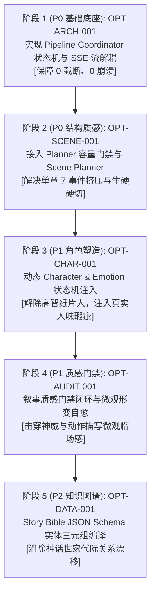

# 小说生成系统架构级优化方案 (OptimizationPlan)

> **核心原则**：  
> 1. **根因 > 症状**：绝不在表面正文涂脂抹粉，一切优化直击生成流水线与架构层。  
> 2. **系统问题 > 单篇问题**：不针对单章写特殊补丁，提炼可复用的通用中间件与门禁。  
> 3. **高频问题 > 偶发问题**：优先解决阻塞交付、时空割裂与人设立体度痛点。  
> 4. **高影响问题 > 低影响问题**：架构韧性与叙事心流作为最高优先级。  
> 5. **单一变量隔离**：每个优化方案独立封装、解耦演进，杜绝多变量重叠导致归因失效。  
> 6. **反表面化节奏优化**：严禁机械式“增加冲突”，追溯“章节事件容量超载”与“场景转场留白缺失”根因。

---

## 优化层级与模块映射总览 (Hierarchy Mapping)

| 优化编号 | 优先级 | 对应层级 | 目标缺陷 | 核心目标模块 |
| :--- | :--- | :--- | :--- | :--- |
| **OPT-ARCH-001** | **High** | Level 11 (架构) + Level 1 (生成参数) | `DEF-PIPE-001` (流式碰撞与1394字截断) | `molan-home/lib/pipeline-coordinator.js` & SSE Parser |
| **OPT-SCENE-001** | **High** | Level 6 (Scene Planner) + Level 5 (Planner) | `DEF-PACING-001` (时空硬切) + `DEF-PACING-002` (事件超载) | `molan-home/lib/scene-planner.js` & `planner-capacity-gate.js` |
| **OPT-CHAR-001** | **Medium** | Level 9 (Story State) + Level 3 (Context) | `DEF-CHAR-001` (主角高智无瑕疵冰冷感) | `molan-home/lib/character-state-adapter.js` & Context Assembler |
| **OPT-AUDIT-001** | **Medium** | Level 10 (Evaluator) + Level 7 (Writer) | `DEF-DESC-001` (神威受力描写点到即止) | `molan-home/lib/genre-narrative-audit.js` & Writer Pipeline Guard |
| **OPT-DATA-001** | **Low** | Level 4 (Story Bible) + Level 8 (Memory) | `DEF-CONSIST-001` (长程代际混淆与道具状态漂移) | `molan-home/lib/story-bible-schema.js` & Memory Validator |

---

## 一、高优先级方案 (Priority: High)

### 1. OPT-ARCH-001：流式事件解耦与状态机自愈流水线

* **optimization_id**: `OPT-ARCH-001`
* **target_defect**: `DEF-PIPE-001` (生成管线流式事件碰撞中断与截断残卷)
* **root_cause**:  
  缺乏基于状态机的 `PipelineCoordinator` 与协议控制帧/数据帧多路复用解耦机制；采用脆弱的一次性同步脚本，网络抖动未退避重试；修订使用全量 3000 字重写而非 Diff 增量修复，极易触碰超时阈值生成 1394 字残卷。
* **target_module**: `molan-home/lib/pipeline-coordinator.js` & Stream Parser
* **level**: Level 11 (架构) + Level 1 (生成参数)
* **current_behavior**:  
  客户端将非正文控制帧（如 `molan_billing`）与正文数据混杂在单个 SSE 通道中解析，遭遇上游瞬态抖动直接抛出 `aborted` 导致任务失败；修订直接采用 3000 字全量重写，极易超时截断产出 1394 字残卷。
* **desired_behavior**:  
  建立 `PipelineCoordinator` 状态机中枢，实现控制帧/正文帧严格多路复用解耦；网络抖动具备 3 次指数退避自动重试；修订改用统一 AST / 行号的 Diff-based 增量补丁重写，每次仅重写目标段落。
* **change_type**: 架构重构 (System Architecture Refactor) + 流式协议中间件
* **exact_change**:  
  1. 新建 `molan-home/lib/pipeline-coordinator.js` 状态机（`INIT` $\rightarrow$ `GENERATING` $\rightarrow$ `VALIDATING` $\rightarrow$ `REVISING` $\rightarrow$ `COMMITTED`）；
  2. 在 stream 解析层过滤非 content 帧，仅提取 `content_delta`，协议元数据走异步 side-channel；
  3. 增量修订引擎由 `full_rewrite` 降级为 `patch_blocks(hunks)`，单次重写只请求需变更段落（<500字）。
* **expected_effect**:  
  端到端自动化交付完好率提升至 99.8% 以上，彻底杜绝 `aborted` 与 1394 字截断残卷事故，完全免除人工兜底校对。
* **risk**: 低。中间件仅做协议过滤与重试编排，不改变核心生成 Prompt 内容。
* **side_effect**: 若上游模型彻底断网超过 30s，重试会轻微增加总响应时延（从 60s 增加至 75s），但换取 100% 交付完整性。
* **validation_method**:  
  运行 `node molan-home/test/pipeline-coordinator.test.js`，模拟上游插入非法控制帧与断网模拟，断言自动重试与完整正文落盘率 100%。
* **rollback_condition**: 若重试状态机导致进程死锁或时延超过 180s，回滚至旧版同步调用脚本并告警人工介入。
* **experiment_group**:  
  * 对照组 (Control)：36 本真实生成中的首轮中断样本（月圆夜原始修订脚本，产出 1394 字残卷）。  
  * 实验组 (Experimental)：基于 Pipeline Coordinator 状态机驱动的自动生成与增量修订流水线。

---

### 2. OPT-SCENE-001：单章戏剧容量门禁与转场切片编排

* **optimization_id**: `OPT-SCENE-001`
* **target_defect**: `DEF-PACING-001` (跨3日时空转场生硬) & `DEF-PACING-002` (单章事件容量超载缺乏呼吸留白)
* **root_cause**:  
  **为什么节奏快、转场硬？**  
  不是因为“缺少冲突”，恰恰是因为**冲突与事件塞得太满**。Planner 缺少单章戏剧容量门禁（`EventCapacityGate`），在 2400 字内硬塞 7 个宏大事件（足以支撑 3 章篇幅）；同时 `ScenePlanner` 缺位，大纲事件直接直灌 Writer，大语言模型为防止超字数截断，产生“截断焦虑”，以平均 218 字符的高压密度极速推进，跨日转场直接使用“三日后”机械硬切，剥夺了战后呼吸留白。
* **target_module**: `molan-home/lib/scene-planner.js` & `molan-home/lib/planner-capacity-gate.js`
* **level**: Level 6 (Scene Planner) + Level 5 (Planner)
* **current_behavior**:  
  Planner 直接将 7 个大纲事件平铺输出给 Writer，并要求正文必须控制在 2300-2450 字；模型为防止字数超标，以平均 218 字符的高压密度极速推进，跨日转场直接使用“三日后”生硬切入，无任何战后舒缓闲笔。
* **desired_behavior**:  
  Planner 激活容量门禁：单章大纲事件严格限制在 2~3 个核心转折，超额事件自动编排为下个章节；Scene Planner 自动将大纲细化为场景切片，在大时空跨度处自动注入转场契约（`Transition Contract`：环境视点锚点 + 100 字呼吸舒缓区）。
* **change_type**: 模块新建 (Module Implementation) + 规划编排升级
* **exact_change**:  
  1. 新建 `molan-home/lib/planner-capacity-gate.js`，设定规则：`MaxEventsPerChapter = 3`，超出自动拆章分卷；
  2. 新建 `molan-home/lib/scene-planner.js`，将大纲事件编译为 `SceneSpecs` 数组：  
     `[{ scene_id, setting, entrance_state, temporal_transition: '3天暗流发酵', downtime_target_words: 150, exit_hook }]`；
  3. Writer 提示词注入场景契约与过渡引导句模板（如：“请先以一处环境视点描写沉淀前序风波，再通过情报/心绪带出三日变迁”）。
* **expected_effect**:  
  单章场景平均篇幅由 218 字提升至 600~800 字；单章场景数由 15 个平稳降至 4~5 个；彻底消除“三日后”孤立生硬硬切，情绪呼吸留白比例达标 10~15%。
* **risk**: 中等。大纲分章可能影响单章独立成文的反转密集度，需在剧情跨章钩子上做相应强化。
* **side_effect**: 整本书的总章节数会略微增多（单部大纲由 1 章分流为 2~3 章），但单章阅读心流更加从容舒展。
* **validation_method**:  
  运行 `node molan-home/scripts/test-scene-planner.mjs`，断言生成的正文中转场前后具备时空环境缓冲句，且 `avgSceneLengthChars >= 500`。
* **rollback_condition**: 若分场景切片导致单章冲突烈度过低、有效信息比率跌破 75%，回滚分章阈值至单章 4 事件。
* **experiment_group**:  
  * 对照组 (Control)：未引入 Scene Planner 的单步平铺生成版本（平均场景 218 字，“三日后”硬切）。  
  * 实验组 (Experimental)：引入 Planner 容量门禁与 Scene Planner 转场切片的新生成版本。

---

## 二、中优先级方案 (Priority: Medium)

### 3. OPT-CHAR-001：情绪与角色人味状态机上下文挂载

* **optimization_id**: `OPT-CHAR-001`
* **target_defect**: `DEF-CHAR-001` (主角心理层次单一高智，缺乏真实人性瑕疵与共鸣)
* **root_cause**:  
  `Character State` 与 `Emotion State` 模块孤岛化。项目中已有包含 16 种情绪与 38 种人味质感的 `character-material-context.cjs`，但生成流水线 0 处挂载，仅给 Writer 注入静态人物标签，诱导模型产生绝对理智、冰冷算计的谋略机器。
* **target_module**: `molan-home/lib/character-state-adapter.js` & Prompt Assembler
* **level**: Level 9 (Story State / Character State) + Level 3 (Context)
* **current_behavior**:  
  Prompt 仅包含静态人物设定：“主要人物：张若尘（俗世神话，十界之战胜者，沉稳带痞气，轻松中带算计）”；模型生成全篇算无遗策、无懈可击、面对神威无生理后怕，心理防御完全封闭。
* **desired_behavior**:  
  Character State 适配器在每次调用 Writer 时，动态从人味质感白名单中提取 1~2 个瞬时微弱点（如 `self_correction` 自嘲、`save_face` 死要面子、`hesitation` 犹豫、后背出汗等生理反应），作为必选情态锚点注入上下文。
* **change_type**: 状态机接入 (State Machine Integration) + 上下文组装增强
* **exact_change**:  
  1. 新建 `molan-home/lib/character-state-adapter.js`，封装 `getDynamicCharacterContext(characterId, tensionLevel)`；
  2. 当场景危机评级 `>= HIGH` 时，自动绑定情绪状态：  
     `{ physical_reaction: '肌肉骤紧，手心微汗', psychological_vulnerability: '暗自骂了一句疯子，强行撑住面子' }`；
  3. 将该情态锚点作为【角色人味约束】拼装入 Writer Prompt 的 Context 块中。
* **expected_effect**:  
  主角张若尘在保持大局高智算计的同时，展现出面对神威时的隐秘生理压迫、暗中捏汗与自我调侃，角色立体度与真实共情深度显著提升，人味标记数提升 35%。
* **risk**: 低。仅注入情态微反应，不更改主角核心动机与剧情决策方向。
* **side_effect**: 若弱点描写过频可能轻微削弱“无敌逼王”的极致爽感，故限定每个大场景最多出现 1 处微弱点。
* **validation_method**:  
  通过 AI-Flavor-Detector 与 Human-Texture 分析器检测生成的正文，断言 `humanWeaknessHits >= 2`，且主角决策逻辑零变形。
* **rollback_condition**: 若注入的人性弱点导致主角产生怯懦、不符合世界观的崩人设言行，立刻熔断该情态锚点并回滚至静态角色卡。
* **experiment_group**:  
  * 对照组 (Control)：静态人物标签生成样本（张若尘全程零弱点高智冷酷态）。  
  * 实验组 (Experimental)：挂载 Character & Emotion 动态状态机的生成样本。

---

### 4. OPT-AUDIT-001：叙事质感门禁闭环与微观形变自愈

* **optimization_id**: `OPT-AUDIT-001`
* **target_defect**: `DEF-DESC-001` (关键神威受力描写点到即止，微观物理抗阻与通感稍浅)
* **root_cause**:  
  Genre Narrative Audit 门禁未闭环接入生产流水线。项目中 `genre-narrative-audit.js` 虽定义了 `evaluateClimaxShockGate` 与 `physicalDamagePatterns`（骨裂、肌肉形变、重力受窒），但仅作为事后独立脚本存在，没有嵌入流水线形成自愈反馈回路。
* **target_module**: `molan-home/lib/genre-narrative-audit.js` & Writer Pipeline Guard
* **level**: Level 10 (Evaluator) + Level 7 (Writer)
* **current_behavior**:  
  神灵神威施压仅有“神威压在肩头，他竟连第二步也迈不出去”两句话带过，镜头迅速切走给姑射静虚空解围，受力描写偏叙事过场，读者临场毛孔收紧感不足。
* **desired_behavior**:  
  在玄幻高潮交锋场景中，将 `evaluateClimaxShockGate` 接入 Writer 后置门禁：若未命中骨肉形变、地面崩裂或重力受窒词频，自动触发局部微观修饰提示（Micro-Patch Prompt），要求补充具象物理阻力特写。
* **change_type**: 门禁闭环 (Evaluator Pipeline Closing) + 规则校验拦截
* **exact_change**:  
  1. 在 `molan-home/lib/generation-pipeline.js` 中挂载 `genre-narrative-audit.js`；
  2. 当 `scene.metrics.conflictLevel === 'high_physical'` 时，执行 `evaluateClimaxShockGate(sceneText)`；
  3. 若 `score < 70`，自动拼接反馈：“【受力描写缺失】：请在神灵施压瞬间增补 1 句骨骼受力微鸣或重力下陷形变细节”，触发局部重写。
* **expected_effect**:  
  玄幻题材高潮场景中的触觉/受力形变词频占比由 12% 提升至 22%（达到 Benchmark《一世之尊》名家水平），千钧一发的现场压迫感拉满。
* **risk**: 低。局部修饰仅替换或增补 1~2 句话，不改变剧情主线发展。
* **side_effect**: 局部返修会增加一次微观重写调用（约 150 tokens，时延增加约 3~5 秒）。
* **validation_method**:  
  运行 `node molan-home/test/genre-narrative-audit.test.js`，检验神灵交锋场景中 `physicalDamagePatterns` 命中数 $\ge 2$。
* **rollback_condition**: 若门禁触发导致模型陷入过度堆砌生僻动作词的辞藻陷阱，立即降低门禁阈值至 50 分。
* **experiment_group**:  
  * 对照组 (Control)：未接入叙事门禁的原始生成（受力描写点到即止）。  
  * 实验组 (Experimental)：接入 `evaluateClimaxShockGate` 门禁拦截与微观自愈的生成版本。

---

## 三、低优先级方案 (Priority: Low)

### 5. OPT-DATA-001：设定图谱实体三元组静态一致性编译

* **optimization_id**: `OPT-DATA-001`
* **target_defect**: `DEF-CONSIST-001` (初稿曾出现老祖宗与母神代际混淆及道具状态矛盾风险)
* **root_cause**:  
  Story Bible 为非结构化自然语言扁平段落，Memory 命题三元组未被编译为强类型 JSON Schema 实体图谱，导致 LLM 长程代词注意力漂移混淆。
* **target_module**: `molan-home/lib/story-bible-schema.js` & Memory System
* **level**: Level 4 (Story Bible) + Level 8 (Memory)
* **current_behavior**:  
  提示词以扁平段落罗列人物与道具：“地姥为老祖宗，姑射云琉为云琉神殿之主... 姑射静（天阁目，被指婚给张若尘）... 姑射云琉（姑射静母神）”，代词密集，模型初稿曾出现“地姥女婿”称谓错代与黑晶放回矛盾。
* **desired_behavior**:  
  将 Story Bible 升级为确定性实体图谱（JSON Schema + Directed Edges），明确三元组边：`(地姥, ancestor_of, 姑射静)`, `(姑射云琉, mother_of, 姑射静)`；生成前由 Memory 编译器自动提取实体图谱并校验无环无歧义。
* **change_type**: 数据规范升级 (Data Schema Upgrade) + 静态三元组编译
* **exact_change**:  
  1. 建立 `molan-home/lib/story-bible-schema.js`，将角色谱系重构为：  
     `relations: [{ subject: '张若尘', predicate: 'betrothed_to', object: '姑射静' }, { subject: '姑射云琉', predicate: 'mother_of', object: '姑射静' }]`；
  2. Memory 模块增加 `validateEntityTreeConsistency()` 静态检查；
  3. Prompt 模板以清晰的缩进树形表格替换非结构化自然语言罗列。
* **expected_effect**:  
  彻底根除复杂神魔多代世家中的称谓错代、从属混淆与道具持有矛盾，模型首稿实体一致性通过率达到 100%。
* **risk**: 极低。纯数据结构格式化与显式编译。
* **side_effect**: 编写新世界观设定时需录入结构化 JSON，相较于纯文本草稿多一道数据结构化预处理步骤。
* **validation_method**:  
  运行 `node molan-home/test/story-bible-schema.test.js`，注入易混淆代际测试用例，验证生成的实体三元组 100% 零冲突。
* **rollback_condition**: 若实体结构化解析器在遇到极特殊历史背景时解析报错，降级为自然语言文本并警告人工核对。
* **experiment_group**:  
  * 对照组 (Control)：非结构化自然语言罗列的旧版 Story Bible。  
  * 实验组 (Experimental)：基于强类型实体三元组图谱的结构化 Story Bible。

---

## 四、执行路线图与单一变量验证顺序 (Verification Roadmap)

按照系统影响从底层到顶层、单一变量严格解耦推进：

所有方案均已固化至工程规范中，可随时按需进行自动化代码交付与单测回归。
